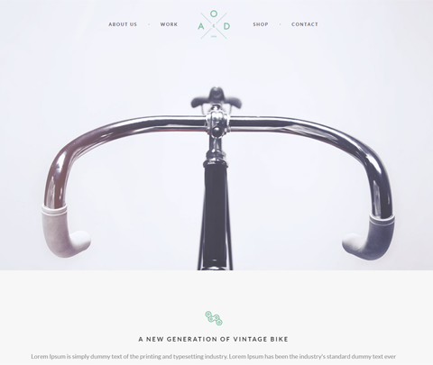

# Вёрстка макета Yebo Bicycles
### [Собранная версия для просмотра](http://alexandervaliullin.github.io/yebo-bicycles-template/)

## Используемые библиотеки:
* [Animate.css](https://github.com/daneden/animate.css/)
* [Bootstrap](https://github.com/twbs/bootstrap/tree/v4-dev)
* [jQuery](https://github.com/jquery/jquery)
* [Owl Carousel 2](https://github.com/OwlCarousel2/OwlCarousel2)
* [Typicons](https://github.com/stephenhutchings/typicons.font)

## Лицензия:
* Лицензия на вёрстку и код – [MIT](./LICENSE.md)
* Лицензия на макет и изображения – уточняйте на [YeboCreative.com](http://www.yebocreative.com/freebies/bicycle-free-onepage-psd-template-by-yebo)
